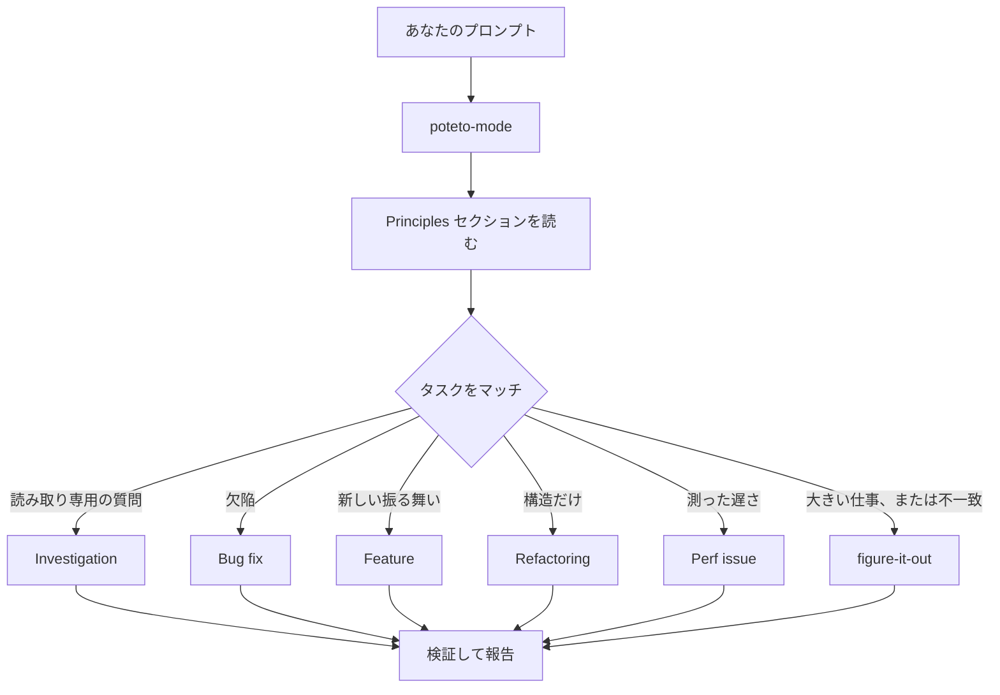

# `/poteto-mode` に仕事を通す

`/poteto-mode` が入り口です。ゴールを渡すと、22 あるプレイブックのひとつに当て、その手順を todo にコピーし、ステップが必要とするほかのスキルを呼びます。このページでは、良いプロンプトがどんな形か、そして実際にはどれだけ短くてよいかを学びます。


## プロンプトに何が起きるか



図はよく使うルートです。ほかにも、メトリクスのヒルクライム、実行時の症状や取得済みトレースの診断、プロトタイプ、見た目の一致、スキルの作成と評価、自律実行、PR やスタックをマージ可能な状態まで世話する、検証済みスタックの出荷、PR キューをオートパイロットで回す、プロジェクト規模のプログラムの指揮、セッション引き継ぎ、安全な一時停止、複数フェーズの計画、ワークツリー掃除、があります。全セットは [プレイブックディレクトリ](https://github.com/cursor/plugins/tree/main/pstack/skills/poteto-mode/playbooks/) にあります。

## 儀礼ではなくゴールを言う

仕様書は書きません。何がおかしいか、何が欲しいか、すでに分かっていてエージェントの時間を節約できることだけを言います:

```text
/poteto-mode users get two notifications after a retry. repro first, then fix and verify.
```

これは Bug fix のプロンプトです。「repro first」は礼儀ではなく本物の制約で、プレイブックはそれを守ります。todo に Bug fix の手順が埋まるのを見てください。飛ばしたステップは `skip: <理由>` 付きで残ります。

会話がすでに文脈を持っているなら、プロンプトはほとんど要らなくなります。次のどれでも十分です:

```text
/poteto-mode do it
```

```text
continue
```

```text
keep going until done
```

短くて済むのは、モードが会話に張り付き、構造をプレイブックが持っているからです。言葉は意図を運び、スキルが厳密さを運びます。

## 話題が変わるときは "new task"

長いチャットは、直前のタスクの文脈を溜めます。主題を変えるときは、そう言ってください:

```text
/poteto-mode new task. figure out why the cache entry survives logout. don't change any code yet.
```

"new task" は、前のプレイブックを続けるのではなく、付け直す合図です。"don't change any code yet" は Investigation に固定します。この 2 句が無いと、Feature の途中のモードは、質問を次の機能ステップとして扱いがちです。

## 並列作業には専用のワークツリーを

同じリポジトリに複数エージェントを向けると、作業ツリーを奪い合います。最初から隔離を頼んでください:

```text
/poteto-mode new task. branch off <base> in a fresh worktree, then port the parser change there.
```

タスクごとにブランチとワークツリーを分ければ、互いのファイルを踏みません。[Opening a PR プレイブック](https://github.com/cursor/plugins/blob/main/pstack/skills/poteto-mode/playbooks/opening-a-pr.md) は、コード変更ではもともとワークツリーから動くので、特定のベースや場所が重要なときだけ言えば足りることが多いです。

ワークツリーは溜まります。ディスクが苦しくなったら:

```text
/poteto-mode what's eating my disk? prune the worktrees that are safe to prune.
```

[Worktree cleanup プレイブック](https://github.com/cursor/plugins/blob/main/pstack/skills/poteto-mode/playbooks/worktree-cleanup.md) は、すべてのワークツリーをマージ状態、未コミット作業、まだ触っているチャットで分類します。証拠が消してよいものだけ消し、未コミットを抱えているものはあなたの判断を待ちます。

## 動かしたままにする

席を外すときは、完了の意味を言って出てください:

```text
/poteto-mode im stepping away. keep going until the migration check reports zero old callers. log your decisions.
```

あとでレビューする仕事は [`/figure-it-out`](https://github.com/cursor/plugins/blob/main/pstack/skills/figure-it-out/SKILL.md) に流れます。実行のフェーズを設計し、[`/show-me-your-work`](https://github.com/cursor/plugins/blob/main/pstack/skills/show-me-your-work/SKILL.md) の判断ログを残します。一晩の契約の全体は [寝ているあいだに回す](./07-overnight.md) です。

**落とし穴:** プロンプトでスキルを列挙しないこと（「use /how, then /architect, then /arena...」）。プレイブックがすでに順序を持っています。手書きの手順の並びは、プレイブックが残したはずのステップを並べ替えたり落としたりしがちです。スキル名を出すのは、特定の選択を上書きしたいときだけです。

ルーティング規則の全体は [`poteto-mode`](https://github.com/cursor/plugins/blob/main/pstack/skills/poteto-mode/SKILL.md) 自体を読んでください。

次: [コードを理解する](./03-understand.md)。
