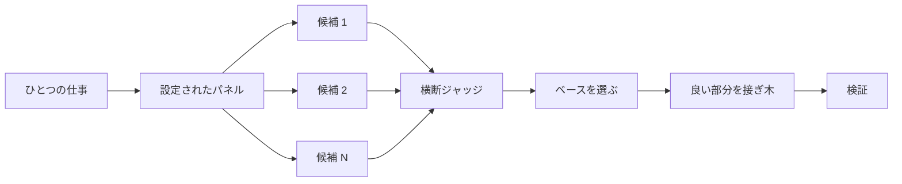

# コードを書く前に設計する

難しい設計を一発でやると、モデルが最初に思い浮かべた形が固定されます。`/architect` は実装の前に型と境界を決めます。`/arena` は同じブリーフに対して複数の試みを走らせ、良い部分を合成します。`/interrogate` は別モデルに結果を壊させにいきます。仕事が設計の合成ではなくカバレッジなら、`/swarm` がスライスやレースを広げ、結果を集約します。


## `/architect` で形を決める

```text
/architect design the import pipeline before writing any code. i care most about how callers use it.
```

[`/architect`](https://github.com/cursor/plugins/blob/main/pstack/skills/architect/SKILL.md) はまず現状のコードに足場を置きます。設計が触るコードに `/how` をかけ、所有権やレイヤを動かすときは `/why` もかけます。そのあと `/arena` で競合する設計スケッチを出します。各スケッチは呼び出し側の使い方を先に書き、続けて型、シグネチャ、モジュール地図です。

デフォルトでは、合成した設計から実装へそのまま進みます。設計を先に見たいなら、そう言ってください:

```text
/architect with checkpoint. stop and show me before implementing.
```

## `/arena` で試みを広げる

```text
/arena take my prompt to the arena verbatim. i want to compare their proposals with yours.
```

[`/arena`](https://github.com/cursor/plugins/blob/main/pstack/skills/arena/SKILL.md) がその下にある汎用ツールです。N 体のサブエージェントが同じ設計またはコードのブリーフを並列で試み、それぞれ自分のワークツリーかディレクトリに書きます。読み取り専用のジャッジが、設定が許せば別モデルファミリで、ルーブリックに照らして全候補を採点します。コーディネーターは各候補を端から端まで読み、ベースを選び、敗者の良いアイデアを接ぎ木し、結果を検証します。



パネルは [`/setup-pstack`](https://github.com/cursor/plugins/blob/main/pstack/skills/setup-pstack/SKILL.md) の設定から来ます。タスクごとに変えられます。判断が重いときは候補を増やし、そうでなければ減らしてください:

```text
/arena this, 5 candidates. the cache key format is expensive to change later.
```

## `/swarm` でスライスとレースを覆う

```text
/swarm check every package under packages/ against its check.sh. one worker per package. one report.
```

[`/swarm`](https://github.com/cursor/plugins/blob/main/pstack/skills/swarm/SKILL.md) は、独立したスライス、カバレッジ行列、ガントレットのレーン、探索の区画、宣言したレースの腕に N 体のワーカーを広げます。各ワーカーは自分の範囲とチェックを持ち、`PASS`、`ISSUES`、`BLOCKED` を報告します。親はワーカーを待ち、欠落や脱落を含むひとつの短い報告を返します。

並列がカバレッジを買うとき、または独立したチェックを競争させたいときに使ってください。`/arena` は全員に同じ設計またはコードのブリーフを渡し、ベースを選んで良い部分を接ぎ木します。`/swarm` はスライスを覆うか、先に選抜規則を宣言したレースを回します。ベース選択と接ぎ木の儀礼は使いません。

## `/interrogate` で壊す

```text
/interrogate the whole branch, but skeptically. no nitpicks unless it's an actual bug or regression.
```

[`/interrogate`](https://github.com/cursor/plugins/blob/main/pstack/skills/interrogate/SKILL.md) は、同じ差分、意図、ルーブリックを、別モデルファミリの複数レビューアに送ります。モデルの多様性がポイントです。盲点が違うので、2 モデルが独立に上げた指摘は信頼度が高い信号です。リードはすべてを `Act on`、`Consider`、`Noted`、`Dismissed` に分け、却下には理由を付け、自動では何も適用しません。

却下も読んでください。リードは実務的なシニアであり、神託ではありません。上書きできます。

## タスクにどれだけの設計が要るか

全部の変更にこれが要るかというと、要りません。たいていの変更には何も要りません。粗い梯子です:

- 小さくて済んでいるが確信が無い変更は、`/interrogate` だけで足りる。
- 関数境界をまたぐ、または所有権を動かす変更は `/architect` に値する。`/arena` も一緒に来る。
- 独立した試みが効く単独の判断（命名、フォーマット、アルゴリズム）は、直接 `/arena`。
- カバレッジ行列、並列チェックの集合、腕を宣言したレースは `/swarm`。
- 覆すのが高い、争点のある設計は `/architect`、出荷前に `/interrogate`。

`/poteto-mode` はこの梯子をすでに適用します。境界をまたぐ仕事では `/architect` が自動的に起動するので、これらを直接呼ぶのは、既定より多い、または少ない精査が欲しいときが主です。

次: [作って差分をきれいにする](./05-build-and-clean.md)。
