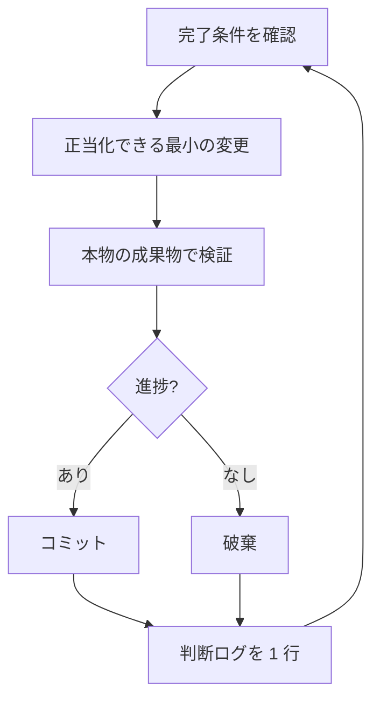

# 寝ているあいだに仕事を回す

ここまでの見返りがここにあります。自分の仕事を検証できるエージェントは、難しい仕事と二人きりにできます。安全にするのは希望ではありません。確認できる完了条件、隔離されたワークツリー、朝に監査する判断ログです。


## 一晩の契約

良い引き継ぎには、ゴール、完了条件、許可、逃げ道があります。長くなくてよいです:

```text
/poteto-mode im going to bed. migrate every caller to the new parser in a fresh worktree off <base>.
done means zero old callers, all parser fixtures pass, old api deleted.
keep a decision log. don't ask me before committing.
/loop until done. if you're truly stuck after a few hours, stop and write up why.
```

各行が買っているものを順に見ます:

- "im going to bed" はセッション上書きです。エージェントは確認の質問をしなくなり、進み続けます。
- "done means..." は、毎回の反復が走らせられる確認にゴールを変えます。
- "fresh worktree off `<base>`" は、開いているほかのものと衝突しないようにします。
- "don't ask me before committing" は、エージェントが止まる原因になる許可を、先回りして与えます。
- `/loop` は pstack のスキルではなく、Cursor 組み込みのウェイク機構です。[Autonomous run プレイブック](https://github.com/cursor/plugins/blob/main/pstack/skills/poteto-mode/playbooks/autonomous-run.md) が、イベントやハートビートで完了条件を再確認するのに使います。
- 逃げ道は、本当の行き止まりで止まり、理由を書かせます。8 時間かけてゴールを創造的に読み替えるよりましです。

席を外したあとにこの仕事をレビューするので、`/poteto-mode` は [`/figure-it-out`](https://github.com/cursor/plugins/blob/main/pstack/skills/figure-it-out/SKILL.md) に流します。コードの前に実行のフェーズを設計し、判断ログを配線します。

## ループが夜中に何をするか



毎回、変更ひとつ、確認ひとつ、ログ 1 行です。効かなかった変更は残さず捨てます。頭打ちなら止めるのではなく方針を変え、完了条件が静かに緩んで勝利宣言することはありません。

## 朝の監査

[`/show-me-your-work`](https://github.com/cursor/plugins/blob/main/pstack/skills/show-me-your-work/SKILL.md) が、実行をレビュー可能にします。各行は時刻、フェーズ、判断、理由、証拠へのポインタ、結果を、`decisions.tsv` の TSV に残します（複数実行がディレクトリを共有するときは `.audit/<task-slug>.tsv`）。既定ではローカルのままです。レビューアが結果を信じるのに軌跡が要るほど野心的な仕事なら、コミットしてください。

戻ったら、レビュー用の形で実行を聞いてください:

```text
/show-me-your-work catch me up on what you did last night
```

スキルが要約を返す前に、別モデルファミリのレビューアを立ち上げて軌跡とトランスクリプトを読ませ、返事の末尾に Attention 節を付けて、あなたの精査が要るものを列挙します。その節を先に読み、指しているログ行を見てください。夜全体を読み返すのではなく、判断を監査します。

## 夜がタスクではなくキューを持つとき

上の契約は、ひとつの仕事をひとつの完了条件まで運びます。夜がもっと持つこともあります。独立した変更のキューや、プログラム全体です。同じ信頼を拡大するプレイブックが 3 つあります。

[Autopilot-full](https://github.com/cursor/plugins/blob/main/pstack/skills/poteto-mode/playbooks/autopilot-full.md) は、独立した PR のキューをマージまで回します。PR ごとにオーナーエージェントが 1 体、ビルドからマージまで運び、オーナーは自分の評決だけではマージしません。新しい検証者のスウォームがマージ可能な先頭をすべて確認し、きれいな評決だけがマージを許可します:

```text
/poteto-mode full autopilot on this queue. each item is independent. i want them merged by morning.
```

[Autopilot-stack](https://github.com/cursor/plugins/blob/main/pstack/skills/poteto-mode/playbooks/autopilot-stack.md) は同じオーナーループですが、何も出荷しません。朝には線形の Graphite スタックが 1 本、各リンクに検証者の評決が付いていて、レビューと着陸は自分でします。変更が結合しているとき、または何かがマージされる前に自分の目が欲しいときは、Autopilot-full よりこちらです:

```text
/poteto-mode autopilot these five changes but stack them, don't ship. i'll land the stack in the morning.
```

[Orchestrate](https://github.com/cursor/plugins/blob/main/pstack/skills/poteto-mode/playbooks/orchestrate.md) は、1 体の寿命を超えるプログラム用です。複数日、多数のスタック PR、常設のコーディネーターチャットの下にサブエージェントの艦隊。コーディネーターはブリーフを書き、サブエージェントが終えたものを集め、未マージのいちばん下の PR を緑に保ち、自分ではコードを書きません。意図して重い機械です。1 体が 1 セッションで終えられる仕事なら、プレイブック自身が上の一晩契約へ戻します:

```text
/poteto-mode orchestrate the store migration. own it until every package is converted and merged. i'll check in twice a day.
```

**落とし穴:** 時間の長さは完了条件ではありません。"work on this for 4 hours" はエージェントに確認するものを与えず、朝には結果ではなく 4 時間の動きがあります。`/loop` には、合格か不合格かが付く述語を渡してください。

次: [原則の名前で舵を切る](./08-principles.md)。
