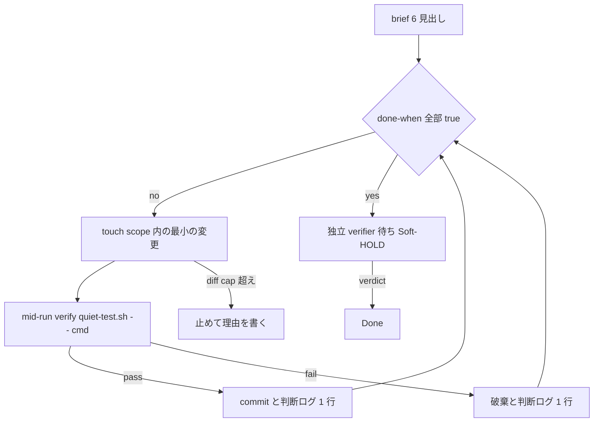

# overnight /goal（brief の形）

## Purpose

Planner の ADOPT 行は [`trend-log.md`](../decisions/trend-log.md) の 2026-09-05 Hermes /goal overnight repo cleanup である。mid-run verify と独立 verifier は同じ台帳の Astra long-running loop 行である。適用 issue は [issue 89](https://github.com/maplefukku/grok-bot-ops/issues/89) である。引用は [overnight-goal-cleanup](sand-workflow:overnight-goal-cleanup)、[Cloud開発](sand-workflow:cloud)、[parallel-fire-fleet](sand-workflow:parallel-fire-fleet)、tool-path-prefer、[job-brief](sand-workflow:job-brief) である。

このページは WRAP だけである。一晩の契約の原文は pstack ガイド [`07-overnight.md`](../guide/07-overnight.md) である。overnight の runner は既存の [overnight-goal-cleanup](sand-workflow:overnight-goal-cleanup) と Cloud Agent である。新しい overnight harness は置かない。Amp、Orbs、自前 runner は invent しない。Hermes と Copilot の製品は採用しない。パターンだけである。

## 対象

開発リーダー と PdM が overnight の /goal を切るとき。impl CA が一晩の brief を受けるとき。PR確認 が朝の merge sweep で見るとき。

FIRE は [`README.md`](./README.md) D の平日 09:00 から 22:00 の内側である。CA だけが夜を走る。merge sweep と thrash kill は 09:00 まで待つ。静穏の時計は変えない。

## 範囲

### 対象にする

overnight /goal brief の 6 見出しと、その shape を判定する [`scripts/overnight_goal.py`](../../scripts/overnight_goal.py) である。LOCK は [`scripts/test_overnight_goal.py`](../../scripts/test_overnight_goal.py) が持つ。証拠は `scripts/quiet-test.sh -- python3 scripts/ci.py` である。

### 対象にしない

verifier 席の自動化は Soft-HOLD である。CreateAgent は置かない。webhook から fixer への auto-exec は HOLD REJECT のままである。プロダクトコードはこのリポジトリに書かない。on-demand は置かない。時間の長さは完了条件ではない。

## brief の形

overnight /goal の brief は次の 6 見出しを持つ。[job-brief](sand-workflow:job-brief) の Goal / done-when / touch scope / diff cap に mid-run verify と verifier を足した形である。見出しは h2 である。no-new-box と OOS は任意である。

```text
## Goal
一文。何を掃除するか。

## done-when
- 合否が確認できる述語を 1 行ずつ。コマンドと期待値。
- 時間の長さは書かない。

## touch scope
disjoint な glob。unbounded（* や ** だけ）は置かない。

## diff cap
N files、N lines、または domain-unit（1 unit = 1 PR）。

## mid-run verify
scripts/quiet-test.sh -- <cmd>

## verifier
impl CA から独立した席。今は PR確認 の merge-ok 4 行と PdM の Flag Y。
```

| 見出し | 規則 | 落ちる例 |
|---|---|---|
| done-when | 合否が付く述語である。時間の長さは完了条件ではない | `work on this for 4 hours` |
| touch scope | disjoint glob。lane 規則は [`README.md`](./README.md) B である | `**` |
| diff cap | `N files`、`N lines`、`domain-unit` のどれか。点滴 micro-PR は禁止である | `small` |
| mid-run verify | 毎反復、commit の前に `quiet-test.sh -- <cmd>` を通す。Quiet is not skip | `npm test` |
| verifier | 作者 CA ではない。独立の verdict が Done の前に入る | `self` |

判定は [`scripts/overnight_goal.py`](../../scripts/overnight_goal.py) である。issue の本文をそのまま流す。スクリプトが見るのは形である。見出しの有無、時間の長さ、unbounded glob、diff cap の型、quiet-test の経路、verifier の否定語である。述語の中身と glob の disjoint は人が見る。verifier は席を名指す。「作者ではない」のような否定形は落ちる。

```text
gh issue view <n> --json body -q .body | python3 scripts/overnight_goal.py -
```

issue 89 の本文は mid-run verify と verifier を持たない。判定は `missing ## mid-run verify` と `missing ## verifier` の 2 行である。ADOPT 前の brief の形はここまでであった。

## 夜のループ



反復ごとに変更 1 つ、verify 1 つ、ログ 1 行である。verify に落ちた変更は残さない。diff cap を超えたら止めて理由を書く。done-when を緩めて勝利宣言しない。判断ログは pstack `/show-me-your-work` である。

## verifier（Soft-HOLD）

verifier は作者 CA ではない。Done の前に独立の verdict が入る。今の verdict は [`PR確認`](../../bots/PR確認.md) の merge-ok 4 行と PdM の Flag Y である。人である。見るのは CI と PR の形である。done-when を独立に再評価する席は今は無い。それが Soft-HOLD の中身である。別モデル族の critique は CA の内側で行ってよい。

verifier 席の自動化（Astra 型 verifier bot）は Soft-HOLD である。CreateAgent は置かない。新しい席は置かない。新しい harness は FAIL である。

## 禁止

| 禁止 | 破る規則 |
|---|---|
| 時間の長さを done-when に書く | 時間の長さは完了条件ではない |
| unbounded な touch scope | lane は disjoint glob である |
| 点滴 micro-PR | diff cap は domain-unit。1 unit は 1 merge である |
| quiet-test を通さない verify | Quiet is not skip。新しい harness は FAIL である |
| 作者 CA が自分で Done を宣言する | verifier は独立である |
| verifier bot の CreateAgent | Soft-HOLD。席は増やさない |

## 関連

出荷単位と lane は [`README.md`](./README.md) である。PR 本文の 4 見出しは [`pr-body.md`](./pr-body.md) である。CI 梯子は [`ci-ladder.md`](./ci-ladder.md) である。quiet-test は [`quiet-test.md`](./quiet-test.md) である。採択の台帳は [`trend-log.md`](../decisions/trend-log.md) である。
