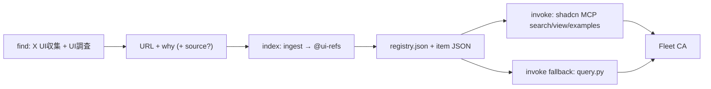

# ui-library MCP（callable UI library）

CBO + CPO + Buddy SPEC LOCK。ユーザー言語 **`ui-library`**。CreateAgent NONE。DT #84 / ZN / sauna / gakuse / product apps **PARK**。Mem0 / Discord-as-DB / 第二 library skill / 第二 MCP 席 — **invent しない**。

## gbo survey（invent=N）

| 既存 | パス | 役割 |
|---|---|---|
| 索引 + ingest + query WRAP | [`scripts/ui_library/`](../../scripts/ui_library/) | `@ui-refs` registry JSON |
| 手順 | 本ページ | MCP wire + ownership |
| ノウハウ | [`docs/knowhow/ui-library.md`](../knowhow/ui-library.md) | find WRAP + 境界 |
| 自作 skill | [`skills/`](../../skills/README.md) | **0 個のまま**（ui-library-invoke は skill ファイルにしない） |

ギャップは **fleet curated registry** のみ。custom MCP server は WRAP 不足時だけ — 現状 `query.py` + shadcn MCP で done-when を満たす。

## Buddy pattern（1° cite）

find → implement → index → remote MCP invoke。

- 1°: [x.com/taiyo_ai_gakuse/status/2098811650484863400](https://x.com/taiyo_ai_gakuse/status/2098811650484863400) · [2098423635338002618](https://x.com/taiyo_ai_gakuse/status/2098423635338002618)
- fleet WRAP 種: `ref-seed-buddy-taiyo-find-index-mcp`（fixture、`meta.fleet.seedPosts`）

## Ownership（WRAP EXISTING）

| 段 | 誰 | 何 |
|---|---|---|
| find | **X UI収集** + [**UI調査**](../../bots/UI調査.md) | X plugin / 調査 skill。新 seat なし |
| implement | **ui-library CA**（本 PR） | gbo registry + docs + query WRAP のみ。Grok Bot 本体・product code なし |
| index | **gbo** `@ui-refs` | URL + why + optional `source`；use-case **kebab** + **description** |
| invoke | **ui-library-invoke**（手順名） | **MCP 第一**（shadcn）。CA VM で MCP 不可 → **registry 読み**（`query.py`）fallback。Mem0 禁止 |
| wire | Cursor運用 + add-connector | 下記。connector seat invent 禁止 |

## OSS調査

| 項目 | 値 |
|---|---|
| Primary（1°） | https://ui.shadcn.com/docs/mcp |
| Primary（registry） | https://ui.shadcn.com/docs/registry/mcp |
| Cursor plugin | `/add-plugin shadcn` — [marketplace](https://cursor.com/marketplace/shadcn)（CBO: plugin id **6948** / InstallPlugin WRAP） |
| ライセンス | shadcn/ui MIT |
| clone | しない |

**Fleet curated refs（X/KAWAI URL+why）≠ shadcn コンポーネント。** 同じ MCP 席から `@shadcn` と `@ui-refs`（別名 `@fleet-ui` 可）を読む。

## MCP wire（Cursor運用 — HARD Prefer）

順序: **InstallPlugin / add-connector より shadcn 公式 WRAP を先**。

1. **Cursor plugin（推奨）**: `/add-plugin shadcn` — MCP `npx shadcn@latest mcp` を同梱（[plugin.json](https://github.com/shadcn-ui/ui/blob/main/.cursor-plugin/plugin.json)）。
2. **手動 AddMcpServer**: プロジェクト [`.cursor/mcp.json`](https://ui.shadcn.com/docs/mcp) に `"command": "npx", "args": ["shadcn@latest", "mcp"]`。
3. **Registry namespace** — `components.json`:

```json
{
  "registries": {
    "@ui-refs": "https://raw.githubusercontent.com/maplefukku/grok-bot-ops/main/scripts/ui_library/data/{name}.json",
    "@fleet-ui": "https://raw.githubusercontent.com/maplefukku/grok-bot-ops/main/scripts/ui_library/data/{name}.json"
  }
}
```

`@fleet-ui` は CBO 別名；正本 catalog name は `@ui-refs`。

Grok Bot: Settings → Plugins / add-connector — [`plugins.md`](../knowhow/plugins.md)。**connector 席は増やさない。**

## 索引と invoke



| shadcn MCP tool | fleet `query.py`（fallback / CI 証明） |
|---|---|
| `search_items_in_registries` | `search` |
| `view_items_in_registries` | `view` |
| `get_item_examples_from_registries` | `examples` |

CA VM で live MCP が起動しない場合: **exact wire は上記 1–3** + `quiet-test.sh -- python3 scripts/ui_library/query.py view <name>` で registry schema と fixture を証明する。

## Memory shape（index entry）

| フィールド | 必須 | 格納 |
|---|---|---|
| URL | MUST | `meta.fleet.sourceUrl` |
| why | MUST | `meta.fleet.ingestedWhy` + `description`（索引） |
| source | optional | `meta.fleet.source`（X cite 等） |

Mem0 / Discord-as-DB — 禁止。

## Ingest contract

[`ingest.py`](../../scripts/ui_library/ingest.py) — `IngestInput(url, why, use_cases?, source?)`.

## done-when（CBO）

| 条件 | 観測 |
|---|---|
| `@ui-refs` + item JSON | [`registry.json`](../../scripts/ui_library/data/registry.json) |
| ingest ≥1 URL+why | `ref-seed-buddy-taiyo-*` + `ref-fixture-x-ui-blocks-hero` |
| search/view/examples | 下記テスト |
| PR 4 見出し | [`pr-body.md`](./pr-body.md) |
| merge | しない |

## テスト

```bash
./scripts/quiet-test.sh -- bash -c 'cd scripts && python3 -m unittest ui_library.test_registry'
./scripts/quiet-test.sh -- python3 scripts/ui_library/query.py search mcp-invoke --use-case workflow
./scripts/quiet-test.sh -- python3 scripts/ui_library/query.py view ref-seed-buddy-taiyo-find-index-mcp
./scripts/quiet-test.sh -- python3 scripts/ui_library/query.py examples Buddy --use-case workflow
```

quiet は skip ではない。
