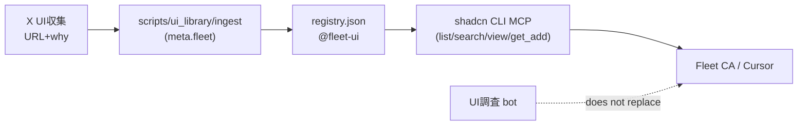

# ui-library MCP（callable UI library）

ユーザー言語コンテキスト **`ui-library`** 1 枚。CreateAgent NONE。第二 MCP 席は invent しない。

## OSS調査

| 項目 | 値 |
|---|---|
| Primary URL | https://ui.shadcn.com/docs/registry/mcp |
| Alt | https://github.com/search?q=shadcn-ui-mcp-server&type=repositories |
| ライセンス | shadcn/ui MIT（registry ツールは CLI 同梱） |
| できること | registry 上の list / fuzzy search / view / get_add（install コマンド） |
| 不足 | fleet 固有の X UI収集 ingest は持たない → 本リポの registry JSON + ingest contract で WRAP |
| clone | しない |

## 呼び手

| 呼び手 | いつ | 見るもの |
|---|---|---|
| impl CA（ui-library unit） | lane を受けたとき | 本ページ、[`docs/knowhow/ui-library.md`](../knowhow/ui-library.md) |
| fleet CA | リモート UI 参照が欲しいとき | Cursor MCP（shadcn）+ `@fleet-ui` registry |
| X UI収集 | find → memory の URL+why だけ渡す | ingest contract（下） |
| PdM | merge sweep | [`pr-body.md`](./pr-body.md)、[`ci-ladder.md`](./ci-ladder.md) |

## 索引と MCP 席



1. **MCP 席（1 つ）**: `npx shadcn@latest mcp init --client cursor` で shadcn 同梱 MCP を使う。parallel MCP プロトコルは invent しない。
2. **索引**: [`scripts/ui_library/data/registry.json`](../../scripts/ui_library/data/registry.json) は [registry schema](https://ui.shadcn.com/schema/registry.json) 互換。
3. **ローカル query/get（テスト・CI）**: `scripts/quiet-test.sh -- python3 scripts/ui_library/query.py search "hero" --use-case landing`

### components.json（プロダクト側 WRAP 例）

プロダクトリポジトリのルート（または CA 作業ツリー）に置く。connector 席は invent しない。

```json
{
  "registries": {
    "@fleet-ui": "https://raw.githubusercontent.com/maplefukku/grok-bot-ops/main/scripts/ui_library/data/{name}.json"
  }
}
```

カタログ全体は `registry.json` に inline `items` として載せている。shadcn MCP は `@fleet-ui` namespace 経由で search/view する。Primary ドキュメント: [MCP Server - shadcn/ui](https://ui.shadcn.com/docs/registry/mcp)。

### Cursor 運用（wire notes）

- Cursor Settings → MCP: shadcn init が生成する設定をそのまま使う。fleet 用の **第二 MCP サーバ定義は増やさない**。
- Grok Bot の add-connector / Plugins については [`plugins.md`](../knowhow/plugins.md) を見る。GTM connector 用の新席は作らない。
- X plugin は UI収集の **find** に使う。索引と MCP query は **ui-library** lane が持つ。

## Ingest contract（X UI収集 → 索引）

| 入力 | 必須 | 説明 |
|---|---|---|
| `url` | yes | http(s)。UI 参照先 |
| `why` | yes | なぜ fleet 索引に載せるか（UI調査の「近い理由」と同型） |
| `use_cases` | no | ユーザー言語の use-case タグ（例 `landing`, `checkout`） |

```text
pseudocode ingest(url, why, use_cases?):
  assert url is http(s)
  assert why non-empty
  item.name = slug(url)
  item.meta.fleet = { sourceUrl: url, ingestedWhy: why, useCases, context: "ui-library" }
  upsert registry.json items[]
```

実装: [`scripts/ui_library/ingest.py`](../../scripts/ui_library/ingest.py)。CA は Python API または将来の automation から呼ぶ。UI調査 bot の出力を **そのまま** `IngestInput` に載せる。

## 禁止

| 禁止 | 理由 |
|---|---|
| 第二 MCP 席 / parallel MCP protocol | JOB HARD |
| mcp-ui を library index とする | JOB HARD |
| UI調査の置換 | 調査席と索引席の分離 |
| Discord drip | JOB Soft Flag |
| connector 席の invent | plugins 既存 WRAP のみ |

## テスト

```bash
./scripts/quiet-test.sh -- python3 -m unittest ui_library.test_registry
./scripts/quiet-test.sh -- python3 scripts/ui_library/query.py get ref-ui-shadcn-registry-mcp
```

quiet は skip ではない。新 harness は置かない。
