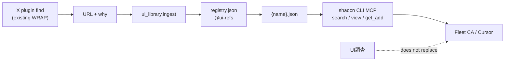

# ui-library MCP（callable UI library）

ユーザー言語コンテキスト **`ui-library`** 1 枚。CreateAgent NONE。第二 MCP 席は invent しない。DT #84 / product apps / 画面 invent は **PARK**（fleet ops ONLY）。

## OSS調査

| 項目 | 値 |
|---|---|
| Primary URL（1°） | https://ui.shadcn.com/docs/mcp |
| Primary URL（registry） | https://ui.shadcn.com/docs/registry/mcp |
| Alt | https://github.com/search?q=shadcn-ui-mcp-server&type=repositories |
| ライセンス | shadcn/ui MIT（registry ツールは CLI 同梱） |
| できること | registry 上の list / fuzzy search / view / get_add |
| 不足 | X UI収集 ingest → `@ui-refs` JSON（本リポ WRAP） |
| clone | しない |

## 呼び手

| 呼び手 | いつ | 見るもの |
|---|---|---|
| impl CA（ui-library unit） | lane を受けたとき | 本ページ、[`docs/knowhow/ui-library.md`](../knowhow/ui-library.md) |
| fleet CA | リモート UI 参照が欲しいとき | Cursor MCP（shadcn）+ `@ui-refs` |
| X UI収集 | find（既存 X plugin）→ handoff **URL+why** | ingest contract（下） |
| PdM | merge sweep | [`pr-body.md`](./pr-body.md)、[`ci-ladder.md`](./ci-ladder.md) |

## 索引と MCP 席



1. **MCP 席（1 つ）**: [`npx shadcn@latest mcp`](https://ui.shadcn.com/docs/mcp)（Cursor は `.cursor/mcp.json` の `npx shadcn@latest mcp`）。自前 MCP プロトコルは invent しない。
2. **索引 namespace**: **`@ui-refs`** — [`scripts/ui_library/data/registry.json`](../../scripts/ui_library/data/registry.json)。
3. **query/get WRAP（CI・fleet ops）**: [`query.py`](../../scripts/ui_library/query.py) が shadcn MCP の search/view に相当する最小 surface（`search`, `get`, `list`）。

### components.json（CA 作業ツリー WRAP 例）

Grok Bot 本体や product apps には書かない。connector 席は invent しない。

```json
{
  "registries": {
    "@ui-refs": "https://raw.githubusercontent.com/maplefukku/grok-bot-ops/main/scripts/ui_library/data/{name}.json"
  }
}
```

### Cursor 運用（wire notes）

- Cursor Settings → MCP: [shadcn 公式手順](https://ui.shadcn.com/docs/mcp) の `.cursor/mcp.json` のみ。fleet 第二 MCP 定義は増やさない。
- Grok Bot add-connector / Plugins: [`plugins.md`](../knowhow/plugins.md)。GTM 用 connector 席は作らない。
- X plugin: UI収集 **find** のみ。索引 + MCP query は ui-library lane。

## Ingest contract（X UI収集 → `@ui-refs`）

| 入力 | 必須 | 説明 |
|---|---|---|
| `url` | yes | http(s)。索引する UI 参照先（X 投稿 URL ではない） |
| `why` | yes | なぜ近いか / 載せる理由 |
| `use_cases` | no | use-case タグ（`landing`, `hero`, …） |

```text
pseudocode ingest(url, why, use_cases?):
  assert url is http(s)
  assert why non-empty
  item.meta.fleet = { sourceUrl: url, ingestedWhy: why, useCases, context: "ui-library" }
  upsert @ui-refs registry.json; write data/{name}.json
```

実装: [`ingest.py`](../../scripts/ui_library/ingest.py)。**Fixture**（live ingest 不可時）: `meta.fleet.fixture: true` + `xCollectPost` で X 由来を明示。例: `ref-fixture-x-ui-blocks-hero`。

## done-when（CPO SPEC）

| 条件 | 観測 |
|---|---|
| `@ui-refs` registry | `registry.json` の `"name": "@ui-refs"` |
| ingest サンプル | `ref-fixture-x-ui-blocks-hero`（URL+why、fixture 明示） |
| MCP search/get | `quiet-test.sh -- python3 scripts/ui_library/query.py search hero --use-case landing` が fixture を返す；`get ref-fixture-x-ui-blocks-hero` |
| PR 4 見出し | [`pr-body.md`](./pr-body.md) / fleet `pr-show-me-template.md` |
| merge | しない（HOLD merge=PM） |

## 禁止

| 禁止 | 理由 |
|---|---|
| 第二 MCP 席 | CPO SPEC |
| UI調査の置換 | 調査 vs 索引 |
| Discord drip / 画面 invent / copy-as-is | CPO PARK |
| connector 席 invent | plugins WRAP のみ |

## テスト

```bash
./scripts/quiet-test.sh -- python3 -m unittest ui_library.test_registry
./scripts/quiet-test.sh -- python3 scripts/ui_library/query.py search hero --use-case landing
./scripts/quiet-test.sh -- python3 scripts/ui_library/query.py get ref-fixture-x-ui-blocks-hero
```

quiet は skip ではない。
